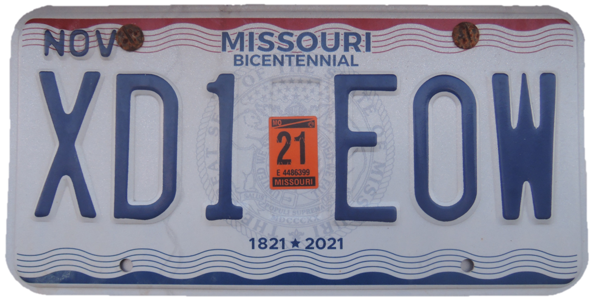
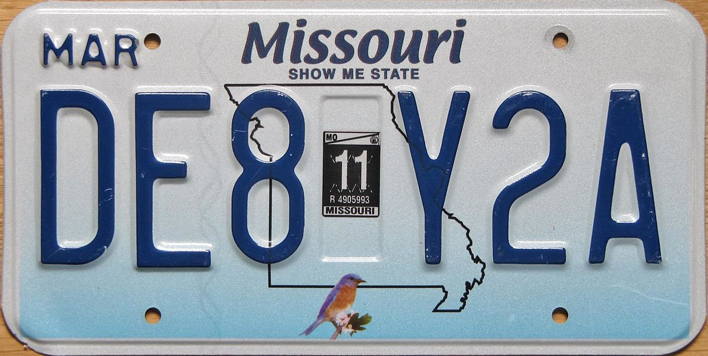
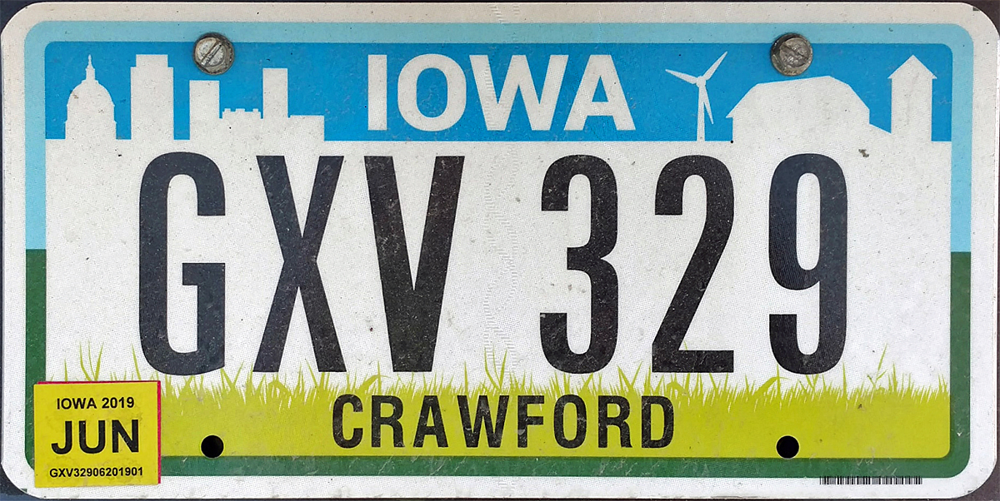
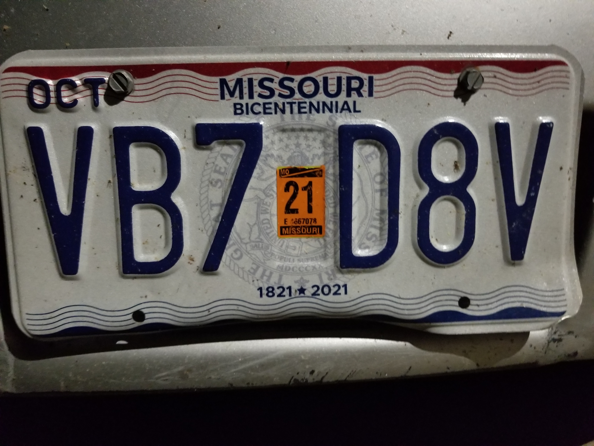

# Parking Snap

This is a demo application that uses Google's MLKit Optical Character Recognition to read the text from a standard Missouri or Iowa license plate and add it to a database of vehicles made using Firebase.

## How to Use

1. Open the app, and press the "Open Camera" button

2. A camera view will open, use that to take a picture of the licence plate (We have included example licence plates below for testing). For best results, try to get a clear, centered picture of the licence plate and avoid having other text in the image.

3. Press the "OK" button if you're statisfied with your picture, or "Rery" to try again.

4. Once you click the "OK" button, the app will try to process the image and display the results in a text view below the image. If this is correct, press the "Check Plate" button; if not, try to take another picture and see if the app can get a better read.

5. Once you click the "Check Plate" button, the app will check the licence plate against the database. If the plate is in the database, the app will display a toast message saying so; if the plate is not in the datbase, a dialog fragment will appear asking you if you would like to add the plate to the database.

6. If you click the "Add" button, you will be taken to a form to create a new vehicle entry. The plate number will be filled out automatically, verify again that it is correct, anc fill out the rest of the information for the vehicle.

7. When you click the "Register" button, the vechicle will be registered in the databse, and you will be taken to a new sreen that lists all the vehicles currently in the database, including the one you just added.

8. That's it! You have succsesfully added a new vehicle to the database. You can also click the "Add New Vehicle" button from the main screen to manually add a vehicle without scanning a licence plate; you can also click the "Vehicle List" button to go straight to the list of vehicles in the databse.

&nbsp;

## Test Licence Plates

Plates 2 and 4 are in the database, plates 1 and 3 are not.

Note that the app can be picky about reading images from a computer screen and may need multiple attempts to get an accurate read, depending on the monitor.

&nbsp;

&nbsp;

&nbsp;

&nbsp;

&nbsp;

&nbsp;

&nbsp;

&nbsp;

&nbsp;

&nbsp;

&nbsp;

